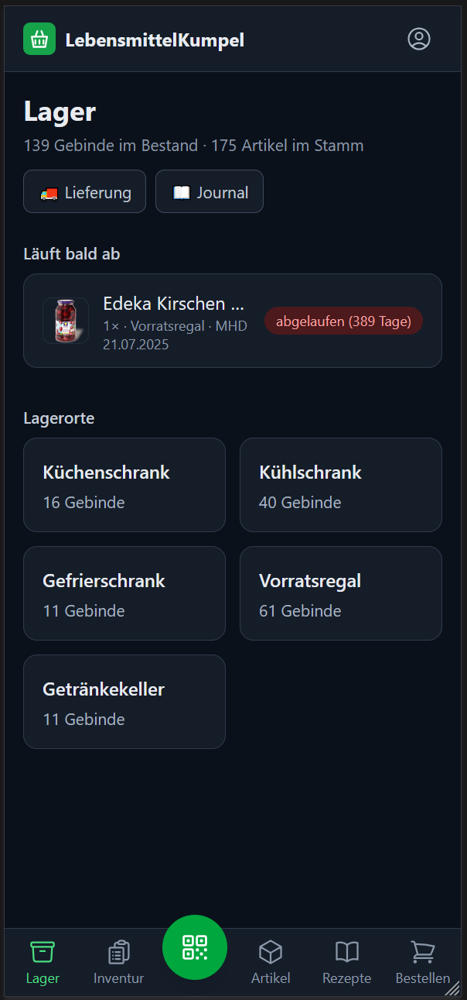
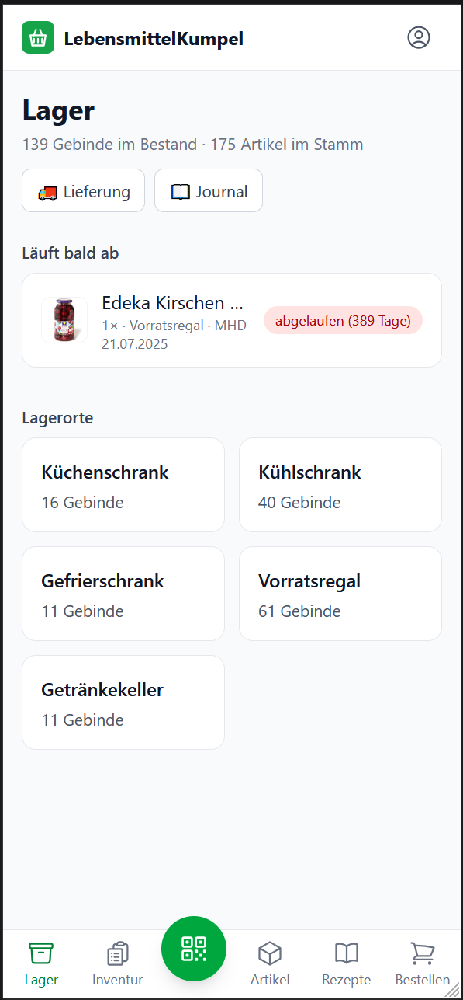
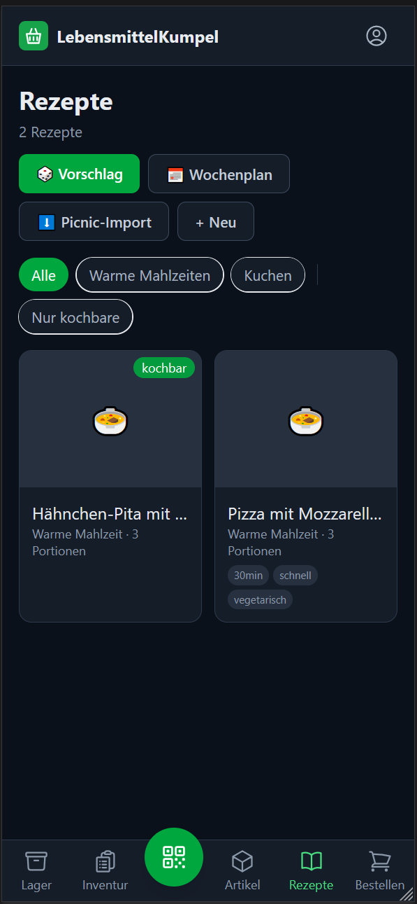
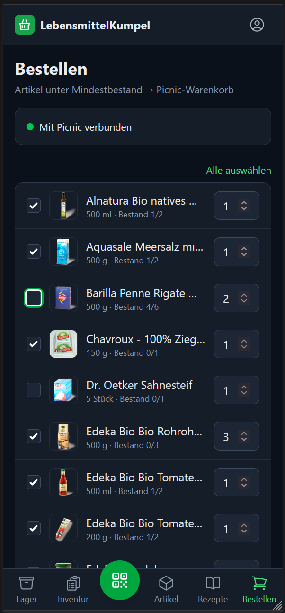

[English](README.md) · **Deutsch** · [Nederlands](README.nl.md)

# LebensmittelKumpel

Selbstgehostete Webapp zur Lebensmittelverwaltung der Familie: Lagerverwaltung
für Vorrat in Keller und Küche, Bestellvorschläge und Lieferungs-Check über den
Picnic-Lieferdienst sowie Verwaltung der Familienrezepte. Smartphone-optimiert
(PWA, hell & dunkel je nach Systemeinstellung), mit Desktop-Ansicht.

> **Für wen ist das?** Für Haushalte, die ihren Vorrat selbst verwalten wollen,
> ohne ihn einem fremden Dienst anzuvertrauen — alles läuft auf dem eigenen
> Server, die Daten liegen in einer SQLite-Datei. Die Picnic-Funktionen setzen
> ein Konto beim Lieferdienst [Picnic](https://picnic.app) voraus (Deutschland,
> Niederlande, Frankreich); ohne Picnic-Konto funktioniert alles andere — Lager,
> Inventur, Artikelstamm, Rezepte, Wochenplan, Journal — unverändert. Die
> Anbindung nutzt die inoffizielle Bibliothek
> [picnic-api](https://github.com/MRVDH/picnic-api); Picnic bietet keine
> offizielle Schnittstelle an, Änderungen dort können die Funktion jederzeit
> brechen. Bestellt wird bewusst nie automatisch.

## Screenshots

<table>
  <tr>
    <td width="25%"></td>
    <td width="25%"></td>
    <td width="25%"></td>
    <td width="25%"></td>
  </tr>
  <tr>
    <td>Lager mit MHD-Warnung</td>
    <td>Helles Theme</td>
    <td>Rezepte, „kochbar" markiert</td>
    <td>Bestellvorschläge</td>
  </tr>
</table>

## Funktionen

- **Oberfläche auf Englisch, Deutsch oder Niederländisch** — je Benutzer auf
  der Konto-Seite gewählt und auf allen Geräten wirksam. Voreingestellt ist
  „Systemsprache": die App folgt der Einstellung des Browsers, sonst gilt
  Englisch. Datum, Wochentage, Zahlen, Preise und Ein-/Mehrzahl folgen der
  Sprache mit. Die eigenen Daten — Artikel, Tags, Rezepte und Lagerortnamen —
  bleiben genau so, wie sie eingegeben wurden.
- **Anmeldung & Benutzer** — Login mit Benutzername + Passwort (scrypt-Hashing),
  Rollen Benutzer/Admin. Nur Admins verwalten Benutzer; jeder kann sein eigenes
  Passwort ändern. Alle Datensätze tragen anlegenden/ändernden Benutzer und
  Zeitstempel (Audit). Die Konto-Seite zeigt unter **Version** die
  App-Version, Build-Zeitpunkt und Commit der laufenden Instanz — praktisch,
  um zu prüfen, ob der Server wirklich den erwarteten Stand fährt — und
  darunter den **Changelog** der Versionen.
- **Lagerverwaltung** — Bestände in frei pflegbaren Lagerorten (ab Werk
  Küchenschrank, Kühlschrank, Gefrierschrank, Vorratsregal, Getränkekeller),
  geführt als Chargen mit eigenem MHD. Ein-/Ausbuchen per Barcode-Scan (FEFO
  beim Ausbuchen), MHD-Ampel und „Läuft bald ab"-Ansicht. Schnelle
  +/−-Korrektur mit frei wählbarer Menge direkt in der Artikelliste, in der
  Lagerort-Ansicht je Charge mit einem Klick (0 löscht die Charge); Chargen
  lassen sich bearbeiten und zwischen Lagerorten umlagern.
- **Lagerorte** (Admin) — anlegen, umbenennen und in der Reihenfolge
  verschieben. Gelöscht wird nie, sondern **stillgelegt**: ein stillgelegter
  Lagerort erscheint nirgends mehr zur Auswahl, seine Bestandshistorie und die
  Journalzeilen bleiben aber lesbar. Stilllegen setzt voraus, dass der Lagerort
  leer ist; der Standard-Lagerort betroffener Artikel wird dabei entfernt.
- **Buchungsjournal** — jede Bestandsveränderung wird festgehalten: Zeitpunkt,
  Benutzer, Artikel, Menge und Lagerort, dazu die Herkunft der Buchung
  (Scanner, Inventur, Lieferung, Artikelliste, Charge). Zu- und Abgänge,
  Umlagerungen (mit Von-/Nach-Lagerort) und Chargen-Korrekturen inklusive
  MHD-Änderungen; ein Abgang über mehrere Chargen erscheint je Charge mit
  ihrem Lagerort. Filterbar nach Artikel, Lagerort, Benutzer und Buchungsart.
  Gelöschte Artikel bleiben mit ihrem Namen lesbar.
- **Inventur** — kompakte Übersicht aller vorhandenen Bestände mit
  Lagerort-Aufschlüsselung. Gezählten Gesamtbestand eintragen, die Differenz
  wird automatisch gebucht (Mehrbestand in den Standard-Lagerort, Minderbestand
  FEFO ausgebucht). Filterbar nach Suche und Artikel-Tags.
- **Artikelstamm** — Name, Bild, Gebindegröße mit Maßeinheit, EAN, optionale
  Picnic-Artikel-ID (Suche oder Direkteingabe), Mindestbestand,
  Standard-Lagerort und frei vergebbare Tags (mit Filter in Artikelliste und
  Inventur). Neuanlage per Barcode-Scan, Vorbefüllung über Open Food Facts und
  Picnic-Produktsuche. Die Artikelseite zeigt alle Chargen des Artikels über
  alle Lagerorte, direkt bearbeit- und umlagerbar. **Import aus Bestellungen:**
  übernimmt Produkte aus den letzten Picnic-Lieferungen samt Bild,
  Gebindegröße und Verknüpfung (einzeln beim Auspacken oder gesammelt
  unter *Artikel → Picnic-Import*; EAN liefert Picnic nicht).
- **Bestellvorschläge** — Artikel unter Mindestbestand landen auf der
  Vorschlagsliste und wandern nach Bestätigung in den Picnic-Warenkorb
  ([picnic-api](https://github.com/MRVDH/picnic-api), inoffiziell). Bestellt
  wird bewusst nie automatisch — der Checkout bleibt in der Picnic-App.
  Abgeglichen wird mit dem **Warenkorb und noch nicht gelieferten
  Bestellungen**, jeweils mengengenau: Was schon vorgemerkt oder unterwegs
  ist, wird nur noch als Fehlmenge vorgeschlagen (oder gar nicht mehr).
  Alle Vorschläge lassen sich mit einem Klick an- und abwählen.
- **Lieferungs-Check** — Beim Auspacken einer Picnic-Lieferung: Positionen per
  Barcode scannen (matcht über die Picnic-ID) und direkt in den Ziel-Lagerort
  einbuchen, per +-Taste einzeln bestätigen oder nach Sichtprüfung alle
  offenen Positionen auf einmal. Noch unbekannte Produkte werden dabei
  automatisch als Artikel angelegt (samt Bild und Gebindegröße). Zeigt
  Produktbilder aus Picnic.
- **Rezepte** — warme Mahlzeiten und Kuchen, Zutaten verknüpft mit dem
  Artikelstamm oder als Freitext, freie Tags. Eine Zutat kann mehrere
  Alternativartikel akzeptieren (z.B. verschiedene Eier-Sorten) — der Bestand
  aller Alternativen wird zusammengezählt. Kochbarkeits-Check gegen den
  Bestand („Was kann ich heute kochen?"), Portionsskalierung und „Fehlende
  Zutaten in den Picnic-Warenkorb" (aufgerundet auf Gebindegrößen). Zufälliger
  Rezeptvorschlag mit 2-Wochen-Sperre für kürzlich Gekochtes, optional nach
  Tags. **Import aus Picnic:** übernimmt Rezepte der Picnic-Rezeptseite mit
  Portionen, Zutaten, Schritten und Tipp (*Rezepte → Picnic-Import*).
- **Wochenplan** — Gerichte für die nächsten 7 Tage planen: Tage auswählen und
  Vorschläge würfeln (ohne Rezept-Wiederholung in der Woche), Tage manuell
  belegen, Portionen anpassen — und die fehlenden Zutaten **aller** geplanten
  Tage in einem Rutsch in den Picnic-Warenkorb legen. Der gemeinsame Vorrat
  wird dabei über die ganze Woche verrechnet (kein Doppelzählen, keine
  unnötigen Mehrfachbestellungen desselben Artikels).

## Versionierung

Die App folgt [Semantic Versioning](https://semver.org/lang/de/). Änderungen
werden in [CHANGELOG.md](CHANGELOG.md) nach dem Muster von
[Keep a Changelog](https://keepachangelog.com/de/1.1.0/) gepflegt; derselbe
Inhalt erscheint in der App auf der Konto-Seite.

## Stack

SvelteKit (adapter-node) · TypeScript · SQLite (better-sqlite3 + Drizzle ORM) ·
Tailwind CSS · PWA · Docker (amd64 + arm64)

Optimiert für schmale Smartphones (iPhone 13 mini, Galaxy A34): Safe-Areas
für Notch/Home-Indicator, 16px-Eingabefelder gegen den iOS-Auto-Zoom,
Homescreen-Icon für iOS und Android. Das Dark Theme folgt automatisch der
Systemeinstellung des Geräts. Ein erkannter Barcode quittiert mit kurzem
Signalton (per Web Audio erzeugt) und Vibration — Letztere ignoriert iOS,
deshalb der Ton. Steht das iPhone auf lautlos, kann iOS auch den Ton
unterdrücken.

## Entwicklung

Voraussetzung: **Node.js ≥ 22.12** (Vite 8).

```sh
cp .env.example .env      # Werte anpassen (siehe unten)
npm install
npm run dev
```

Die SQLite-Datenbank (`local.db`) wird beim ersten Start automatisch angelegt
und migriert. Fehlt ein Benutzer, wird aus `ADMIN_USERNAME`/`ADMIN_PASSWORD` ein
Admin angelegt — ohne diese Variablen kommt man nicht in die App.

Nützliche Skripte:

| Befehl               | Zweck                                               |
| -------------------- | --------------------------------------------------- |
| `npm run dev`        | Dev-Server (Port 5173)                              |
| `npm run build`      | Produktions-Build (adapter-node)                    |
| `npm run check`      | Typecheck (`svelte-check`)                          |
| `npm test`           | Tests der Logik-Module (Vitest)                     |
| `npm run db:generate`| Migration aus dem Schema erzeugen (nach Schema-Änderung) |

## Betrieb mit Docker

```sh
docker compose up -d                              # lokal bauen
# oder produktiv das fertige GHCR-Image:
docker compose -f docker-compose.prod.yml up -d
```

Die App läuft auf Port 3000; alle persistenten Daten (Datenbank, Bilder,
Picnic-Auth-Key) liegen im Volume `./data`. Migrationen und der Lagerort-/Admin-
Seed laufen beim Containerstart automatisch.

Ins Container-Log (z.B. in Portainer sichtbar) schreibt die App beim Start eine
Zeile mit Commit und Build-Zeitpunkt — ein unbemerkter Neustart fällt dadurch
sofort auf. Jede Fehlerantwort ab Status 500 wird mit Zeitstempel, Pfad,
Benutzer und Dauer protokolliert; bei unerwarteten Ausnahmen zusätzlich mit
Stacktrace und einer kurzen Fehler-ID, die auch auf der Fehlerseite erscheint.
Bleibt das Log bei einem Fehler still, lag es nicht an der App. Images werden
per GitHub Actions für amd64 und arm64 nach GHCR veröffentlicht:
`ghcr.io/sirtobyb/lebensmittelkumpel:latest`. `docker-compose.prod.yml` enthält
Traefik-Labels (externes Netzwerk `proxy`, websecure, Certresolver `tls_resolver`).

### Erste Picnic-Verbindung

Beim ersten Öffnen von **Bestellen** einmal mit Picnic verbinden (Login + SMS-2FA).
Der Auth-Key wird im Volume abgelegt und übersteht Neustarts; danach fällt 2FA
nur noch selten an. Ohne Verbindung funktionieren Bestellvorschläge, Lieferungs-
Check und Rezept-Warenkorb nicht.

### Umgebungsvariablen

| Variable          | Beschreibung                                            | Default (Container)           |
| ----------------- | ------------------------------------------------------- | ----------------------------- |
| `DATABASE_URL`    | Pfad zur SQLite-Datei                                   | `/data/lebensmittelkumpel.db` |
| `DATA_DIR`        | Verzeichnis für Bilder und Picnic-Auth-Key             | `/data`                       |
| `ORIGIN`          | Öffentliche URL der App (CSRF-Schutz von adapter-node) | —                             |
| `ADMIN_USERNAME`  | Erster Admin (nur beim Erststart ohne Benutzer)        | —                             |
| `ADMIN_PASSWORD`  | Passwort des ersten Admins                             | —                             |
| `ADMIN_EMAIL`     | E-Mail des ersten Admins (optional)                    | —                             |
| `PICNIC_USERNAME` | Picnic-Zugangsdaten für Warenkorb, Lieferungen, Suche  | —                             |
| `PICNIC_PASSWORD` |                                                        | —                             |
| `BODY_SIZE_LIMIT` | Max. Request-Größe (Foto-Uploads!)                     | `15M`                         |
| `GIT_SHA` · `BUILD_TIME` | Werden beim CI-Build als Build-Args ins Image gesetzt und auf der Konto-Seite unter **Version** angezeigt — so lässt sich prüfen, ob der Server den erwarteten Stand fährt. Lokal ungesetzt → „lokaler Build". | — |

> **Passwörter mit Sonderzeichen** (`#`, `$` …) in `.env` und in der
> `docker-compose*.yml` immer in Anführungszeichen setzen — ein unquotiertes `#`
> wird sonst als Kommentar abgeschnitten.

## Mitmachen

Fehlerberichte und Verbesserungsvorschläge gerne als
[Issue](https://github.com/SirTobyB/LebensmittelKumpel/issues). Vor einem Pull
Request bitte `npm run check`, `npm test` und `npm run build` laufen lassen.
Kommentare und Commit-Nachrichten sind deutsch; die Konventionen des Projekts
stehen in [CLAUDE.md](CLAUDE.md).

## Lizenz

[MIT](LICENSE) — Nutzung, Änderung und Weitergabe frei, ohne Gewährleistung.
Die verwendeten Icons stammen von [Heroicons](https://heroicons.com) (MIT).
